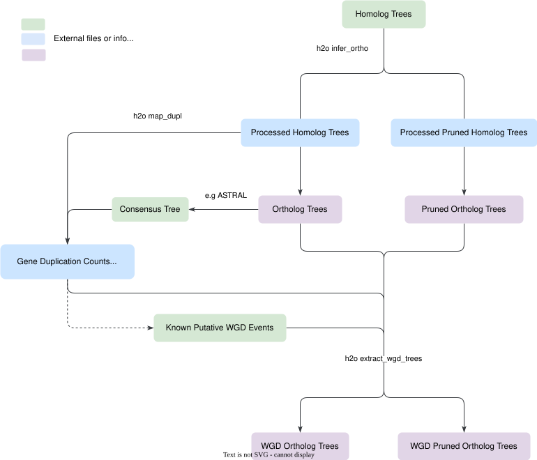
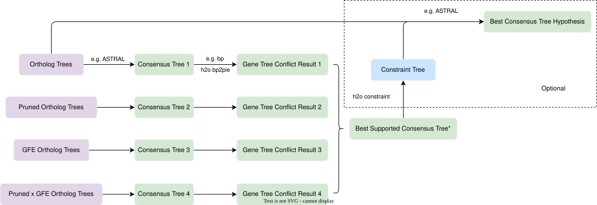
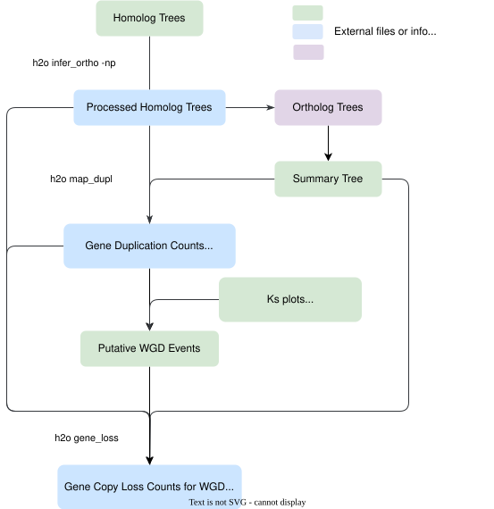
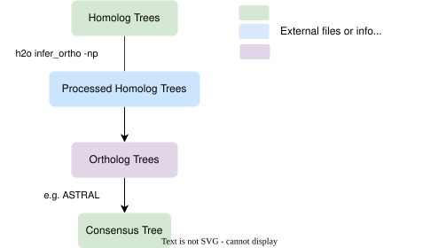

# H2O  <!-- omit in toc -->

[](https://github.com/fkyeeb/H2O/actions/workflows/ci.yml)
[](https://codecov.io/gh/fkyeeb/H2O)

- [Overview](#overview)
- [Installation](#installation)
  - [Install the most recent release with PyPI (not yet available)](#install-the-most-recent-release-with-pypi-not-yet-available)
  - [Build and install from the source](#build-and-install-from-the-source)
  - [Dependency](#dependency)
- [Tutorial](#tutorial)
  - [Example workflows](#example-workflows)
    - [1. *Main workflow* - reducing gene tree discordance created from erroneous orthology inference associated with large-scale GFEs](#1-main-workflow---reducing-gene-tree-discordance-created-from-erroneous-orthology-inference-associated-with-large-scale-gfes)
    - [2. Exploring gene duplications and gene copy losses after large-scale GFE](#2-exploring-gene-duplications-and-gene-copy-losses-after-large-scale-gfe)
    - [3. Simple orthology inference](#3-simple-orthology-inference)
- [Citation](#citation)
- [References](#references)


# Overview
`h2o` is a large-scale gene-family-expansion-aware homolog to ortholog trees command-line tool, for plant phylogenomics. Large-scale gene family expansions (GFE) include whole-genome duplications, segmental duplications, etc. The tool can infer orthology from homologous phylogenetic trees, calculate gene duplication counts, and most importantly, **reduce erroneous orthology inference in clades with large-scale GFEs**. Large-scale GFEs tend to associate with high levels of gene tree discordance, and `h2o` is designed to reduce the discordance created from erroneous orthology inference associated with GFEs.

`h2o` is easy to install with no dependencies and only takes a few minutes to process tens of thousands of trees with > 50 tips. It has the functionality of both Yang and Smith (2014) and [phyparts](https://bitbucket.org/blackrim/phyparts/src/master/) duplication command, enable orthology inference and gene duplication mapping within one software. It also outputs a list of paralog pairs that were duplicated at each node in a consensus "species" tree, which can be used to identify large-scale GFE events with highlighted Ks distributions.

The study introducing `h2o` is submitted for peer review.

# Installation
Installation should work the same way on macOS, Linux, and Windows. You can either install with PyPI or from the source.

## Install the most recent release with PyPI (not yet available)
This option will be available after the study is accepted for publication.

```console
pip install h2o-phy
```

## Build and install from the source

`git clone` the repo to your local directory
```console
git clone https://github.com/fkyeeb/H2O.git
```

Navigate inside the `H2O/` folder and build the package
```console
cd H2O
python -m build
```
Then install the package
```console
pip install dist/h2o-*.tar.gz
```

## Dependency
This package only requires Python version >= 3.8 to run, and no extra Python libraries installation is required.

# Tutorial
**The detailed tutorial of each subcommand of `h2o` is [here](tutorials/tutorial.md).** The content below provides some example workflows for different user scenarios.

> [!TIP]
> `h2o` orthology inference requires homolog trees to have **monophyletic outgroup(s)** to be processed. A grade is fine but they cannot be polyphyletic. It will skip the tree and print out error messages if a homolog tree does not have monophyletic outgroup(s). Consider cleaning your dataset if most of your outgroups are not monophyletic.

## Example workflows

### 1. *Main workflow* - reducing gene tree discordance created from erroneous orthology inference associated with large-scale GFEs

**User scenario**: I have a plant phylogenomic dataset either with known large-scale GFE event(s) or potentially have them, and these events are correlated with gene tree discordance. It is difficult to resolve the relationships right after GFE events, and I would like to explore alternative relationships.

`h2o` employs two approaches to reduce gene tree conflicts induced by large-scale GFEs:
1. Remove taxa that no longer retain both gene copies generated from gene duplications - modified trees are subsequently referred to as <u>*pruned*</u>
2. Select homolog trees that show the gene duplication from large-scale GFE, and only use ortholog trees from these homologs for species tree inference - selected ortholog trees are subsequently referred to as <u>*GFE*</u> trees



`h2o map_dupl` not only maps gene duplications but also outputs a list of paralog pairs that were duplicated at specific nodes and can be used to plot highlighted Ks distributions. Ks calculations are not included in `h2o` but there are many existing scripts and tools that can do it.

This workflow will produce 4 different sets of ortholog trees (purple box) as in the table below. **Both approaches to reduce gene tree conflict remove a lot of data from the trees.** We highly recommend users compare the consensus "species" tree produced from each set of orthologs and the gene tree conflict results to select the best supported consensus tree inferred from your dataset, as shown in the flowchart below. By <u>*more support*</u>, we mean less gene tree discordance. **Nodes with high levels of gene tree discordance can still have an ASTRAL posterior probability of 1**. The steps enclosed by dashed lines are optional.

|  | unpruned |  pruned |
|------|---|---|
| No GFE selection | Ortholog Trees | Pruned Ortholog Trees |
| GFE | GFE Ortholog Trees | Pruned x GFE Ortholog Trees |

The purpose is to explore a better hypothesis for the relationships after large-scale GFE events. While `h2o` removes data from the trees and reduces gene tree conflict, it can cause more nested relationships to be less supported. 

**In your "best supported consensus tree", if you found more support in the relationships right after large-scale GFE events but less support in more nested relationships, please proceed with the optional steps. Subcommand `h2o constraint` can easily extract a constraint tree (for the relationships right after large-scale GFE events) from a consensus tree, and users can use the constraint tree with the full ortholog dataset to produce a constrained consensus tree. Then the "best consensus tree hypothesis" will contain the better supported relationships for both the relationships right after large-scale GFE and also more nested relationships.*



Details of the subcommands and example external software mentioned are in this [tutorial](tutorials/tutorial.md).

> [!TIP]
> In the study that introduces `h2o`, we demonstrated that Pruned x GFE Ortholog Trees maybe have the least amount of gene tree conflict associated with large-scale GFEs, although some distant relationships might be less supported due to the reduction of data.

### 2. Exploring gene duplications and gene copy losses after large-scale GFE

**User scenario**: I would like to explore the patterns of gene duplications in my plant phylogenomic dataset and gene copy losses after large-scale GFE events.

> [!NOTE]
> The consensus tree topology is going to affect the counts. If you are exploring different phylogenetic hypotheses with the main workflow, you may want to use the best-supported topology here.



Details of the subcommands are in this [tutorial](tutorials/tutorial.md).

### 3. Simple orthology inference

**User scenario**: I have a plant phylogenomic dataset with good outgroups, and I would like to produce ortholog trees in one simple step.

This workflow is the first step of the main workflow. Although `infer_ortho` is similar to ortholog inference methods in Yang and Smith (2014), it is not the same as any of the 4 methods. `h2o infer_ortho` requires monophyletic outgroups in the tree and does not keep any tree without outgroups.



# Citation

If you have used `h2o` in your work, please cite:

Feng, K., Gaynor, M. L., and Smith, S. A. Improving detection in large-scale gene family expansions and associated phylogenomic inferences in Ericales and Caryophyllales. *In review*.

# References

Yang, Y., and Smith, S. A. (2014). Orthology inference in nonmodel organisms using transcriptomes and low-coverage genomes: improving accuracy and matrix occupancy for phylogenomics. *Molecular biology and evolution*, 31(11), 3081-3092.