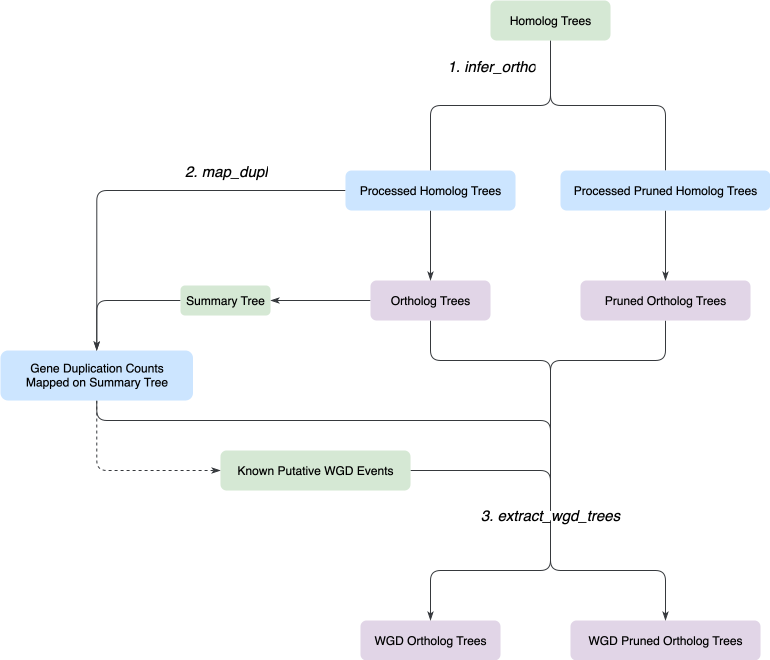
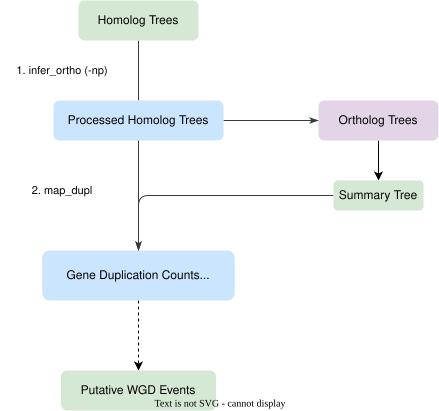

# H2O  <!-- omit in toc -->

- [Overview](#overview)
- [Installation](#installation)
- [Tutorial](#tutorial)
    - [Other useful subcommands](#other-useful-subcommands)
- [References](#references)

# Overview

Ancient WGD-aware homolog to ortholog trees command-line tool, for plant phylogenomics

# Installation

upload to PyPI?

This package only requires python version >= 3.6 to run and no extra python libraries installation required.

# Tutorial
The detailed tutorial of each subcommand of `h2o` is [here](tutorials/tutorial.md). The content below provides the overall workflow for different user scenarios.

## Scenarios `h2o` are designed for:  <!-- omit in toc -->

### 1. Main scenario: I have a plant phylogenomic dataset with known WGD event(s) and these events are correlated with gene tree discordance. It is difficult to resolve the relationships right after WGD events and I would like to explore alternative relationships.  <!-- omit in toc -->

`h2o` employs two approaches to reduce gene tree conflicts induced by WGDs:
1. Remove tips that have lost one of the gene copy from WGD - modified trees are subsequently referred as <u>*pruned*</u>
2. Select ortholog trees that are from homolog trees that show the gene duplication from WGD, and only use them for species tree inference - seleced ortholog trees are subsequently referred as <u>*WGD*</u> trees

This workflow will produce 4 different sets of ortholog trees (purple box) and like in the table below. **Both approaches to reduce gene tree conflict removes a lot of data from the trees.** We highly recommend users to compare the summary "species" tree prodeced from each set of orthologs and the gene tree conflict results to select the best supported summary tree/hypothesis inferred from your dataset. 

The purpose is to explore a better hypothesis for the relationships after WGD events. While `h2o` removes data from the trees and reduce gene tree conflict, it can cause more nested relationships to be less supported. Subcommand `h2o constraint` can easily extract a constraint tree from a summary tree and users can use the constraint tree with the full ortholog dataset to produce a constrained summary tree.

|  | unpruned |  pruned |
|------|---|---|
| No WGD selection | Ortholog Trees | Pruned Ortholog Trees |
| WGD | WGD Ortholog Trees | WGD Pruned Ortholog Trees |

numbered italicized text - `h2o` subcommands

Green box - external files or info

Blue box - Other `h2o` output files

Purple box -  `h2o` output ortholog trees for comparison

### 2. I have a plant phylogenomic dataset and I would like to explore the dataset. I would like to produce reliable ortholog trees and/or calculate gene duplications in my dataset.  <!-- omit in toc -->

This workflow is the first two steps of the previous workflow. 

### Other useful subcommands

gene loss, bp2pie, extract constraint tree

# References
Yang, Y., and Smith, S. A. (2014). Orthology inference in nonmodel organisms using transcriptomes and low-coverage genomes: improving accuracy and matrix occupancy for phylogenomics. *Molecular biology and evolution*, 31(11), 3081-3092.