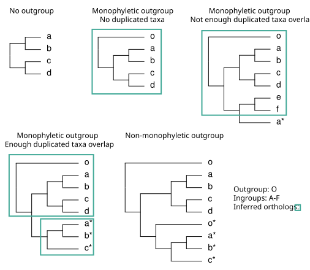

# Table of Contents <!-- omit in toc -->
- [Overview](#overview)
- [1. Orthology Inference - `h2o infer_ortho`](#1-orthology-inference---h2o-infer_ortho)
  - [1.1 Input](#11-input)
  - [1.2 How to run](#12-how-to-run)
  - [1.3 Output](#13-output)
- [2. Gene duplication summary statistics - `h2o map_dupl`](#2-gene-duplication-summary-statistics---h2o-map_dupl)
  - [2.1 Input](#21-input)
  - [2.2 How to run](#22-how-to-run)
  - [2.3 Output](#23-output)
- [3. Extracting trees that show gene duplications at GFE events - `h2o extract_gfe_trees`](#3-extracting-trees-that-show-gene-duplications-at-gfe-events---h2o-extract_gfe_trees)
  - [3.1 Input](#31-input)
  - [3.2 How to run](#32-how-to-run)
  - [3.3 Output](#33-output)
- [4. Inferring gene copy loss after large-scale GFE events - `h2o gene_loss`](#4-inferring-gene-copy-loss-after-large-scale-gfe-events---h2o-gene_loss)
  - [4.1 Input](#41-input)
  - [4.2 How to run](#42-how-to-run)
  - [4.3 Output](#43-output)
- [5. Extracting `bp` conflict result for plotting - `h2o bp2pie`](#5-extracting-bp-conflict-result-for-plotting---h2o-bp2pie)
  - [5.1 Input](#51-input)
  - [5.2 How to run](#52-how-to-run)
  - [5.3 Output](#53-output)
- [6. Extracting constraint tree - `h2o constraint`](#6-extracting-constraint-tree---h2o-constraint)
  - [6.1 input](#61-input)
  - [6.3 Output](#63-output)
- [7. Remove a list of tips from a lot of trees - `h2o rmtips`](#7-remove-a-list-of-tips-from-a-lot-of-trees---h2o-rmtips)
  - [7.1 input](#71-input)
  - [7.3 Output](#73-output)
- [References](#references)

# Overview
`h2o` uses the command line interface to run.

`h2o` is designed for plant phylogenomic datasets that have large-scale GFEs, but is also compatible with clades without them. Datasets that assume single-copy genes are not compatible.

`h2o` employs two approaches to reduce gene tree conflicts induced by large-scale GFEs:
1. Remove taxa that no longer retain both gene copies generated from gene duplications - subsequently refer to as <u>*pruning*</u>  - implemented in [`infer_ortho`](#1-orthology-inference---h2o-infer_ortho)
2. Select homolog trees that show the gene duplication from selected large-scale GFE event, and extract ortholog trees from these homologs for species tree inference - implemented in [`extract_gfe_trees`](#3-extracting-trees-that-shows-gene-duplication-at-gfe-events---h2o-extract_gfe_trees)

Most of the subcommands are not independent of each other. They usually require some results from the previous steps. If you are unsure what subcommands to use, the [README](README.md) file has some example workflows for the package.

There is a tiny subset of Ericales phylotranscriptomic dataset (Carruthers et al. 2024) in the `example_data` folder. The following tutorial runs on this example dataset.

# 1. Orthology Inference - `h2o infer_ortho`

This is the most important subcommand for `h2o`. It takes homolog trees as input and outputs cleaned ortholog trees for consensus "species" tree inference. Output includes both ortholog trees experienced *pruning* (defined in Overview) and the same set of trees without *pruning*.

The detailed steps of this subcommand:
1. Only process homolog trees with monophyletic outgroups (a grade is fine but cannot be polyphyletic). Other trees skipped.
2. Label nodes with gene duplications. The overlapping tips are removed if (1) the tip overlap between two child clades is less than `min_dupl_tip_overlap` (default is 2) or (2) the tip overlap is less than `min_dupl_percentage_overlap`, default is 0.1, of the bigger clade. If the tip overlap is more than both of the two criteria, the node is labeled as a duplication node (node label "D" in Newick tree). These trees are the processed homolog trees (\*rooted_processed\*.tre).
3. If *pruning* is not disabled, the processed homolog trees go through *pruning* (unpruned trees are also kept unless specified).
4. The processed homolog trees are split at the duplication nodes into ortholog trees.

Although it is similar to ortholog inference methods in Yang and Smith (2014), it is not the same as any of the 4 methods. `h2o infer_ortho` requires monophyletic outgroups in the tree and does not keep any tree without outgroups.

Examples for `infer_ortho`:



## 1.1 Input

This subcommand requires homolog trees in individual Newick tree files in one folder, each file with one tree. Tips can be in two formats:
1. Tips of the same taxa should have the same tip name, or they would not be recognized as the same taxa in gene duplication detection.
2. Tips are `sample_name@sequence_id` and an id-to-species-name file is specified with `-f`. Each tip has a unique name due to the sequence id and tips of the same taxa should have the same species name specified in the file, or they would not be recognized as the same taxa in gene duplication detection.

> [!NOTE]
> **We recommend users not to input homolog trees with branches longer than 0.5 substitutions/site.** If homolog trees contain branches that are longer than 0.5 substitutions/site, then this tree should be separated into two homolog trees at this branch. 0.5 substitution/site means on average, half of the sites have substitutions. This branch is too long for a real homologous gene family. `h2o` does not give warnings about branches longer than 0.5, and is likely to take it as a gene duplication and break it into orthologs. In reality, this may not interfere with species tree inference. It may inflate gene duplication numbers, but the inflation should not be significant if the dataset is reasonably good.

## 1.2 How to run

### 1.2.1 Command Options <!-- omit in toc -->

You can also find this information by using `h2o infer_ortho -h`

| Option  | Long Option Name | Required | Description
| ------------- | ------------- | ------------- | ------------- |
| `-t` | `--homolog_tree_dir` | Yes | Folder containing homolog trees
| `-o` | `--outgroup_list` | Yes | List of outgroup taxa, separated by commas, no spaces (mutually exclusive with `-of`)
| `-of` | `--outgroup_file` | Yes | File containing the outgroup taxa, each line is a taxon (mutually exclusive with `-o`)
| `-e` | `--tree_file_ending` | Yes | File ending of the homolog trees
| `-od` | `--output_directory` | No | Output directory, default is creating a `processed_trees/` directory in the current directory
| `-f` | `--id2sp_file` | No | one sample each line, sample_name`<tab>`species_name. Tips are in this format: `sample_name@sequence_id`
| `-m` | `--min_dupl_tip_overlap` | No | Minimum number of tip overlap between two child clades to be considered as a duplication node, default is 2
| `-mp` | `--min_dupl_percentage_overlap` | No | Minimum percentage overlap between two child clades to be considered as a duplication node, default is 0.1
| `-sd` | `--single_sample_duplications` | No | Flag to retain within-sample duplications, which would be removed by default
| `-p` | `--just_pruning` | No | Flag to only produce pruned ortholog trees
| `-np` | `--no_pruning` | No | Flag to only produce unpruned ortholog trees

### 1.2.2 Running the command with example dataset <!-- omit in toc -->

The folders may vary based on your current directory and where you downloaded the dataset. Because the tip names in this example dataset is not unique with sequence ids, so we will not provide the `id2sp_file` with the command, but there is one example file in the `example_data/` folder FYI. First, you would want to navigate into the `example_data/` directory:
```console
cd H2O/example_data
```

To run the default setting, which is producing both the *pruned* and *unpruned* orthologs for comparison, do:

```console
h2o infer_ortho -t ERIC_homolog_subset/ -of ERIC_outgroup.txt -e .subtree
```
If the output directory does not exist, `h2o` will create the folder. Because all output trees are going to be created inside the output directory, this directory, if it exists, is recommended to be empty before running the command.

To only produce pruned ortholog trees, add `-p` to the command. To only unpruned ortholog trees, add `-np`. For example, **if you are only looking for some fast ortholog trees without _pruning_**, do:

```console
h2o infer_ortho -t ERIC_homolog_subset/ -of ERIC_outgroup.txt -e .subtree -np
```

## 1.3 Output

For the default setting, there will be some output and 2 folders written to the output folder `processed_trees/`:
- Rooted homolog trees
- `unpruned/` - contains processed* homolog trees and *pruned* ortholog trees
- `pruned/` - contains processed* homolog trees and *unpruned* ortholog trees

> [!NOTE]
> **processing* is a necessary tree cleaning process, involving labeling duplication nodes and removing tip duplications that are less than `min_dupl_tip_overlap` or `min_dupl_percentage_overlap`. The processed homolog trees in `pruned/` folder also went through pruning.

If the input tree file name is `cluster1.subtree` and `.subtree` is entered as the `tree_file_ending`:
- Rooted homolog trees  - `cluster1_rooted.tre`
- Rooted processed trees - `cluster1_rooted_processed.tre`
- Rooted ortholog trees - `cluster1_ortho1.tre`, `cluster1_ortho2.tre` ...

# 2. Gene duplication summary statistics - `h2o map_dupl`
Now that we have processed all the trees, we can count the gene duplications at each node to support the inference of putative large-scale GFEs. This command is similar to the [phyparts](https://bitbucket.org/blackrim/phyparts/src/master/) duplication command; the criteria of gene duplication identification may be slightly different. The criteria are specified in [`infer_ortho`](#1-orthology-inference---h2o-infer_ortho) detailed steps, as duplication nodes are identified in the previous step. 

For mapping the gene duplications onto the consensus "species" tree, `h2o` is more conservative than  `phyparts`, so the counts might appear to be lower. For a gene duplication node A in a homolog tree to match with a node B in the consensus tree, the ingroup tips of the node A have to be the same or a subset of node B; and the outgroup tips of node A in the homolog tree have to be the same or a subset of that of node B in the consensus tree. If there are more than one possible matches for node B, the most nested node is the match. Since `h2o` is more conservative in terms of mapping, you may find a lot of gene duplications are listed as "n/a" in the output `duplication_counts.tsv`, as they are not matched with any node in the consensus tree, potentially due to gene tree conflict or dirty data.

`map_dupl` provides more detailed results for gene duplications in various TSV files compared to `phyparts`. It also implements an incomplete-lineage-sorting (ILS) correction for gene duplication counts (explained in the `h2o` manuscript) that corrects for potential ILS coincides with the duplications.

## 2.1 Input
This command requires that you have already run `h2o infer_ortho` because all the gene duplication inference for individual homolog trees was done in the `infer_ortho` command. `map_dupl` just summarizes all the information based on the provided consensus tree. 

This command requires the *unpruned* `*_rooted_processed.tre` from the previous command and also a rooted consensus "species" tree computed from all the orthologs. **It is important to make sure all your tip names match if you have gone through some taxonomic changes throughout the analysis.** We are only mapping gene duplications with *unpruned* homolog trees because *pruned* trees are meant for consensus tree inference and not for gene duplication mapping. If *pruned* homolog trees are used, the gene duplications will be mapped to more nested nodes compared to the correct one.

We provided a rooted consensus tree computed from the *unpruned* full Ericales dataset from Carruthers et al. (2024) in `example_data/`. A consensus tree made from the subset dataset can be different from the one  provided. To compute the consensus tree for the example dataset, you can do the following commands, which use two external packages that need to be installed.

First, combine all the ortholog trees in one file, one for the *unpruned* trees, one for the *pruned* ones. The *pruned* consensus tree is not needed for `map_dupl` but it might be of interest to you.
```console
cat processed_trees/unpruned/*_ortho[0-9].tre > ERIC_ASTRAL_in_unpruned.tre
cat processed_trees/pruned/*_ortho[0-9].tre > ERIC_ASTRAL_in_pruned.tre
```

Then computes the consensus tree with [astral4](https://github.com/chaoszhang/ASTER/blob/master/tutorial/astral4.md) and reroots the tree with [phyx](https://github.com/FePhyFoFum/phyx).  `astral4` is the newest version of ASTRAL as this tutorial was written. The old versions should also be fine. We used `-t` to use more threads with `astral4` to make the analyses go faster, but not specified below; you can add `-t` as you see fit for your machine. `phyx` has a lot of useful commands for phylogenetics, highly recommend! `pxrr` is a command within `phyx`.

```console
astral4 -i ERIC_ASTRAL_in_unpruned.tre -o ERIC_ASTRAL_out_unpruned.tre
pxrr -t ERIC_ASTRAL_out_unpruned.tre -f ERIC_outgroup.txt -o ERIC_ASTRAL_rooted_unpruned.tre
```
Do the same for *pruned* trees, commands omitted here.

## 2.2 How to run

### 2.2.1 Command Options <!-- omit in toc -->

You can also find this information by using `h2o map_dupl -h`

| Option  | Long Option Name | Required | Description |
| ------------- | ------------- | ------------- | ------------- |
| `-t` | `--processed_tree_dir` | Yes | Folder containing processed trees, is the output folder from `infer_ortho` |
| `-s` | `--species_tree_file` | Yes | Species tree file |
| `-f` | `--id2sp_file` | No | one sample each line, sample_name`<tab>`species_name. Tips are in this format: `sample_name@sequence_id` |
| `-od` | `--output_directory` | No | Output directory, default is creating an `other_output/` directory in the current directory if not exist|

> [!NOTE]
> `id2sp_file` is the same file that you might have provided in `infer_ortho`. Although it is technically optional, if you would like the `ks_pairs*.tsv` files for the list of paralogs duplicated at each node, this file is required.

### 2.2.2 Running the command with example dataset <!-- omit in toc -->

```console
h2o map_dupl -t processed_trees -s ERIC_ASTRAL_rooted_unpruned.tre
```
> [!TIP]
> The consensus tree topology affects the count. If you found a better supported consensus tree, then it may be good to run `map_dupl` again with that tree. 

## 2.3 Output
Without specifying a different output directory, a folder named `other_output/` will be created. Inside the folder, there will be:
- `duplication_counts*.tsv` - gene duplication counts for *unpruned* and *processed* homolog clusters. There will be two files, one is counts without ILS correction and one is with ILS correction. Counts for each node in each homolog cluster are listed separately. The tab-delimited file will look something like this:

  | tree | 0 | 1 | 2 | 3 | 4 | 5 | ... | n/a |
  |------|---|---|---|---|---|---|---|---|
  | cluster1 | 0 | 0 | 0 | 1 | 0 | 0 | ... | 0 |
  | cluster2 | 0 | 0 | 0 | 0 | 0 | 0 | ... | 0 |
  | cluster3 | 0 | 0 | 0 | 3 | 0 | 0 | ... | 0 |
  | ... |
  
  It summarizes all the gene duplications at each node of each homolog tree. The first column is the name of the homolog tree without `.tre`. The first row is the node numbers in the consensus tree, the same node numbers in `consensus_tree_numbered.tre`. The last column "n/a" lists the number of gene duplications that are not matched with any node in the consensus tree, likely due to gene tree conflict.
- `consensus_tree_numbered.tre` - There are three trees inside this newick tree file. The first tree has node numbers as node labels; the second tree has the sum of gene duplications of all homolog trees at each node as node labels, without ILS correction; the third tree has the sum of gene duplications of all homolog trees at each node as node labels, with ILS correction.
- `ks_pairs*.tsv` - if you specified a `id2sp_file` with your run, two paralog pairs files will be in the output, one without ILS correction, one with ILS correction. Each line is `node_number<tab>cluster_name<tab>paralog_pair`. The pairs are tip names separated by comma.

# 3. Extracting trees that show gene duplications at GFE events - `h2o extract_gfe_trees`
This subcommand gathers the names of homolog trees that show gene duplications at the node of *large-scale GFE events**. Then it extracts the ortholog trees inferred from these homolog trees and concatenates them into a file that is ready for ASTRAL input.

**Large-scale GFE events should be supported by multiple pieces of evidence, not simply from elevated gene duplication counts at nodes. As examples in Yang et al. (2018) and Feng et al. (2024), large-scale GFEs are supported by Ks distributions, chromosome counts, and elevated gene duplication counts. More specifically, we recommend highlighted Ks distributions that we presented in the `h2o` manuscript.*

> [!TIP]
> If your dataset has multiple GFE events and they all correlate with elevated gene tree conflicts in separate parts of the tree, you would need to deal will each event separately, i.e. running this subcommand for each of them.

## 3.1 Input
This subcommand requires the processed ortholog trees from `infer_ortho`, the `duplication_counts.tsv` from `map_dupl`, and node numbers corresponding to large-scale GFE events. 

If one of the `pruned/` or `unpruned/`directories doesn't exist in `processed_tree_dir`, `h2o` will only extract ortholog trees from the existing folder. If neither of those directories exists, this command will not run. The corresponding node numbers for large-scale GFE have to match those in the first tree of `consensus_tree_numbered.tre`.

## 3.2 How to run

### 3.2.1 Command Options <!-- omit in toc -->

| Option | Long Option Name | Required | Description |
|--------|-------------|----------|-------------|
| `-t` | `--processed_tree_dir` | Yes | Folder containing processed trees, is the output folder from `infer_ortho` |
| `-n` | `--gfe_nodes` | Yes | List of GFE node numbers, separated by commas, no spaces |
| `-d` | `--duplication_counts_dir` | No | Duplication counts directory, default is `other_output/` directory in the current directory* |
| `-od` | `--output_directory` | No | Output directory, default is `other_output/` directory in the current directory, create if not exist  |

**If the directory `duplication_counts.tsv` is currently not in `other_output/`, please specify the location of the folder with `-f`.*

> [!NOTE]
> Although you can input more than one node for `-n`, this is only for scenarios when one GFE event may correspond to gene duplication clustering at two neighboring nodes due to ILS and/or hybridization. Other than this, you should only specify one node.

### 3.2.2 Running the command with example dataset <!-- omit in toc -->
The known large-scale GFE is at nodes 3 and 4 in `consensus_tree_numbered.tre`, so run the command as: 

```console
h2o extract_gfe_trees -t processed_trees -n 3,4
```

## 3.3 Output
Unless specified otherwise, `other_output/` is the default output folder. Inside the folder, these new files will be created:
- `cat_unpruned_gfe_trees.sh` and `cat_pruned_gfe_trees.sh` - bash script to concatenate the *unpruned* and *pruned* ortholog trees into one file
  - `extract_gfe_trees` already ran this script for you. If needed, to run these scripts again, do `bash cat_unpruned_gfe_trees.sh` or `bash cat_pruned_gfe_trees.sh`
- `ASTRAL_in_unpruned_gfe_trees.tre` and `ASTRAL_in_pruned_gfe_trees.tre` - concatenated ortholog tree files
  - The first file only contains *unpruned* orthologs that are from homolog trees that show gene duplications at the node of GFE events; the second file only contains those that are *pruned*.
  - These tree files can be used directly as ASTRAL inputs.

# 4. Inferring gene copy loss after large-scale GFE events - `h2o gene_loss`

This subcommand records and maps gene copy loss after large-scale GFE events. It outputs a TSV file for the gene copy loss counts and a tree where the counts are mapped.

## 4.1 Input
This command requires the *unpruned* `*_rooted_processed.tre` from `infer_ortho` command, `duplication_counts.tsv` and `consensus_tree_numbered.tre` from `map_dupl` command. It also requires *known large-scale GFE events**.

**Large-scale GFE events should be supported by multiple pieces of evidence, not simply from elevated gene duplication counts at nodes. As examples in Yang et al. (2018) and Feng et al. (2024), large-scale GFEs are supported by Ks distributions, chromosome counts, and elevated gene duplication counts. More specifically, we recommend highlighted Ks distributions that we presented in the `h2o` manuscript.*

## 4.2 How to run

### 4.2.1 Command Options <!-- omit in toc -->

| Option | Long Option Name | Required | Description |
|--------|-------------|----------|-------------|
| `-t` | `--processed_tree_dir` | Yes | Folder containing processed trees, is the output folder from `infer_ortho` |
| `-n` | `--gfe_nodes` | Yes | List of GFE node numbers, separated by commas, no spaces |
| `-d` | `--duplication_counts_dir` | No | Duplication counts directory, default is `other_output` directory in the current directory* |
| `-od` | `--output_directory` | No | Output directory, default is creating the `other_output/` directory in the current directory, create if not exist |
| `-f` | `--id2sp_file` | No | one sample each line, sample_name`<tab>`species_name. Tips are in this format: `sample_name@sequence_id` |
| `-ils` | `--ils_correction` | No | Flag to use ILS corrected tree, default is using the one without ILS correction |

**If the directory `duplication_counts*.tsv` and `consensus_tree_numbered*.tre` are currently not in `other_output/`, please specify the location of the folder with `-f`.*

### 4.2.2 Running the command with example dataset <!-- omit in toc -->
The known large-scale GFEs are at nodes 3 and 4 in `consensus_tree_numbered.tre`, so run the command as: 

```console
h2o gene_loss -t processed_trees -n 3,4
```

## 4.3 Output

Unless specified otherwise, `other_output/` is the default output folder. Inside the folder, these new files will be created:
- `gene_loss_counts.tsv` - gene loss data after the given large-scale GFE event. The tab-delimited file will look something like this:

  | tree | dupl_clade_count | gfe_node | gene_loss_nodes | gene_loss_tips |
  |------|---|---|---|---|
  | cluster1 | 1 | 3 | 4 | tip1 |
  | cluster1 | 2 | 3 | 5 | tip2,tip4 |
  | cluster2 | 1 | 3 | 4 |  |
  | ... |

  For example, the 3rd line of this example file means: it's data for tree <u>cluster1</u>, it's the <u>second duplicated clade</u> in this tree for <u>GFE event at node 3</u> of the species tree. For this duplicated clade, there is a <u>gene loss at node 5</u> of the species tree; there is also single tip gene loss for <u>tip2</u> and <u>tip4</u>.
- `gene_loss_counts.tre` - gene loss data summarized on the consensus tree. There are two trees inside this Newick tree file. The first tree has node numbers as node labels; the second tree has the number of gene loss events of all homolog trees with the given GFE gene duplication at each node as node labels.

# 5. Extracting `bp` conflict result for plotting - `h2o bp2pie`

`h2o` is built to reduce gene tree conflict induced by large-scale GFEs; then, evaluating gene tree conflict throughout the process is important. We used [bellerophon](https://git.sr.ht/~hms/bellerophon) (`bp`) to infer gene tree conflict, and we implemented a subcommand in `h2o` to take `bp` output directly and digest it into files that are easy to plot in R or with[`gokstad`](https://git.sr.ht/~hms/gokstad).

## 5.1 Input
`bp` output file is required. **To produce the appropriate `bp` result file, `-tv` has to be flagged in the command**. To produce a bp output for the example dataset:

```console
bp -c ERIC_ASTRAL_rooted_unpruned.tre -t ERIC_ASTRAL_in_unpruned.tre -tv > other_output/bp_output_unpruned.txt
```
Note that `ERIC_ASTRAL_in_unpruned.tre` is from [`map_dupl` input section](#21-input).

We also recommend:
- flag `-v` for more verbose results if you would like to see which ortholog tree supports which conflicting topology
- flag `-scut` for support cutoff if you do not want to consider relationships with lower support
- flag `-w` if you have a big ortholog tree dataset. It is a way to parallelize the analyses, and the number of workers can be bigger than the number of threads. "The optimum number? You should experiment." quote Dr. Stephen Smith.
- flag `-rng` if it is still very slow with `-w` flagged. `-rng` allows you to do more "parallelization" by hand. You can split your ortholog tree set into several `bp` runs, and the run time will be significantly reduced. Then, concatenate the results from multiple `bp` runs. `h2o bp2pie` supports summarizing multiple `bp` output produced by `-rng`.

## 5.2 How to run

### 5.2.1 Command Options <!-- omit in toc -->

| Option | Long Option Name | Required | Description |
|--------|-------------|----------|-------------|
| `-f` | `--bp_output_file` | Yes | bp output file, `-tv` has to be flagged when running bp, if multiple, separate by commas, no spaces |
| `-s` | `--consensus_tree_file` | No | Consensus tree file*, provide if branch length different from the tree used to run bp |
| `-p` | `--pie_option` | No | Flag to include unsupported** counts in the gokstad pie tree |
| `-od` | `--output_directory` | No | Output directory, default is the current directory  |
| `-n` | `--run_name` | No | Name of the run, to be added to output file name, default is empty string |

**In case users want to plot `bp` results with a different branch length, you can provide a tree with the same topology but different branch length, compared to the tree you ran `bp` with.*

***In `bp` results, unsupported means that the tree provided does not contain information about this specific bipart/relationship in the consensus tree. It is usually due to missing taxa; having a large number of unsupported trees for each node is normal in large genomic datasets. However, as most folks will interpret unsupported as low support at first glance, the default of `bp2pie` does not include unsupported counts for `gokstad` plotting.*

### 5.2.2 Running the command with example dataset <!-- omit in toc -->

```console
h2o bp2pie -f bp_output_unpruned.txt
```

## 5.3 Output

Unless specified otherwise, the current directory is the default output folder. If more than one bp output file is provided, the `bp2pie` output will be the sum of the results in all output files, except for `bp_output.tre`. Inside the folder, these new files will be created; if `run_name` is provided, it will be added to the end of the file names before the dot:
- `bp_output.tre` - Counts for conflict, concordance, and unsupported as node labels on each tree. This is part of `bp` output. We provide it as a way for visualization and data exploration. If more than one bp output file is provided, this file has the raw output of all the files. For example, if two bp output files are provided, there will be 6 trees in this file: conflict tree 1, concord tree 1, unsupported tree 1, conflict tree 2, concord tree 2, unsupported tree 2 respectively.
- `bp_data.tsv` - Counts for conflict, concordance, and unsupported listed with corresponding node number in the consensus tree. This is for plotting pie charts in the tree with R. The tab-delimited file will look something like this:

  | node_number | conflict | concord | unsupported |
  |------|---|---|---|
  | 1 | 1 | 3 | 0 |
  | 2 | 0 | 2 | 2 |
  | 3 | 4 | 0 | 0 |
  | ... |
-  `bp_consensus_tree_numbered.tre` - Node number as node label, to correspond with `bp_data.tsv`. The default tree is the consensus tree used in `bp` analysis. If a consensus tree with different branch lengths is provided with `-s`, then this corresponding tree with `bp_data.tsv` will be the provided tree.
-  `gokstad_pie.tre` - The input tree for `gokstad` plotting cannot be opened with any tree visualizing application, such as figtree. Example usage with `gokstad`:
```console
gokstad -s -d -b -pie gokstad_pie.tre -o gokstad.svg
```
*Note that the root node is numbered as "0" and does not have any conflict result.*

# 6. Extracting constraint tree - `h2o constraint`
`h2o` removes a lot of data from phylogenomic datasets. Although it can lead to a topology with more support for relationships right after large-scale GFEs, it can lead to less support for more embedded clades. To resolve this dilemma, we offer an option in `h2o` to extract part of the topology from a consensus tree to use as a constraint for phylogenetic analysis. For example, if the consensus tree for `Pruned x GFE` ortholog trees has more support for the relationships near the GFE event, you can specifically extract those relationships and use the topology as a constraint and run ASTRAL with all ortholog trees.

## 6.1 input
This command requires a consensus tree file and a list of nodes or tips to keep in the constraint tree. 

### 6.2.1 Command Options <!-- omit in toc -->

| Option | Long Option Name | Required | Description |
|--------|-------------|----------|-------------|
| `-s` | `--consensus_tree_file` | Yes | Consensus tree file* |
| `-od` | `--output_directory` | No | Output directory, default is the current directory  |
| `-n` | `--nodes` | Yes | List** of nodes to keep, node labels separated by commas, no spaces (mutually exclusive with `-t`) |
| `-t` | `--tips_file` | Yes | File*** containing the tips to keep, each line is a tip (mutually exclusive with `-n`) |

**The consensus tree file needs to have unique node labels for each node, e.g., in `consensus_tree_numbered.tre`. Only the first tree will be read as the consensus tree. Other trees will be ignored.*

***Only one tip is going to be kept for each node in the constraint tree. This one tip is going to be selected at random. If there are single tips that you would like to keep aside from the list of nodes, you can list the tip name with the node numbers, e.g., `2,3,tip_name` or `6,tip_name,20`*

****Only the tips listed in this file are going to show up in the constraint tree.*

### 6.2.2 Running the command with example dataset <!-- omit in toc -->
If the tree that we would like to extract the constraint tree from is `consensus_tree_numbered_pruned_gfe.tre` (provided) and we would like to extract the relationships right after large-scale GFE events, we could:

```console
h2o constraint -s consensus_tree_numbered_pruned_gfe.tre -n 141,132,115,103,77,101,87,2
```
Or extract constraint tree based on a selected list of tips:
```console
h2o constraint -s consensus_tree_numbered_pruned_gfe.tre -t constraint_tips.txt
```

## 6.3 Output
Unless specified otherwise, the current directory is the default output folder. Inside the folder, this new file will be created:
- `constraint_tree.tre` - the constraint tree, example usage with ASTRAL:
```console
astral4 -o ERIC_ASTRAL_out_constraint.tre -c constraint_tree.tre ERIC_ASTRAL_in.tre
```

# 7. Remove a list of tips from a lot of trees - `h2o rmtips`
[phyx](https://github.com/FePhyFoFum/phyx) has a command `pxrmt` that does similar things but it only removes one instance of the provided taxa from the tree file, which is inconvenient for trees with duplicated tips. Thus, we implemented this subcommand in `h2o` to remove all instances of selected taxa for all tree files in a provided folder.

## 7.1 input
One folder with all the tree files to process.

### 7.2.1 Command Options <!-- omit in toc -->

| Option | Long Option Name | Required | Description |
|--------|-------------|----------|-------------|
| `-t` | `--tree_dir` | Yes | Folder containing trees |
| `-od` | `--output_directory` | Yes | Output directory, cannot be the same with `tree_dir` |
| `-e` | `--tree_file_ending` | Yes | File ending for tree files |
| `-rm` | `--tips2remove` | Yes | File containing tips to remove, one per line (mutually exclusive with -sv) |
| `-sv` | `--tips2save` | Yes | File containing tips to save, one per line (mutually exclusive with -rm) |
| `-m` | `--minimum_taxa` | No | Minimum number of taxa in output tree, default is 5 |
| `-f` | `--id2sp_file` | No | one sample each line, sample_name`<tab>`species_name. Tips are in this format: `sample_name@sequence_id` |

### 7.2.2 Running the command with example dataset <!-- omit in toc -->
To remove the two tips listed in `tips2rm.txt` (for no reason):

```console
h2o rmtips -t ERIC_homolog_subset -od ERIC_homolog_subset_rm -rm tips2rm.txt
```

## 7.3 Output
Tree files of the same name (but with selected tips removed or saved) will be written to the output directory.

# References
Carruthers, T., D. J. P. Gonçalves, P. Li, A. S. Chanderbali, C. W. Dick, P. W. Fritsch, D. A. Larson, et al. 2024. Repeated shifts out of tropical climates preceded by whole genome duplication. *New Phytologist* 244: 2561–2575.

Feng, K., J. F. Walker, H. E. Marx, Y. Yang, S. F. Brockington, M. J. Moore, R. K. Rabeler, and S. A. Smith. 2024. The link between ancient whole‐genome duplications and cold adaptations in the Caryophyllaceae. *American Journal of Botany* e16350.

Yang, Y., and Smith, S. A. (2014). Orthology inference in nonmodel organisms using transcriptomes and low-coverage genomes: improving accuracy and matrix occupancy for phylogenomics. *Molecular biology and evolution*, 31(11), 3081-3092.

Yang, Y., Moore, M. J., Brockington, S. F., Mikenas, J., Olivieri, J., Walker, J. F., & Smith, S. A. (2018). Improved transcriptome sampling pinpoints 26 ancient and more recent polyploidy events in Caryophyllales, including two allopolyploidy events. *New Phytologist*, 217(2), 855-870.